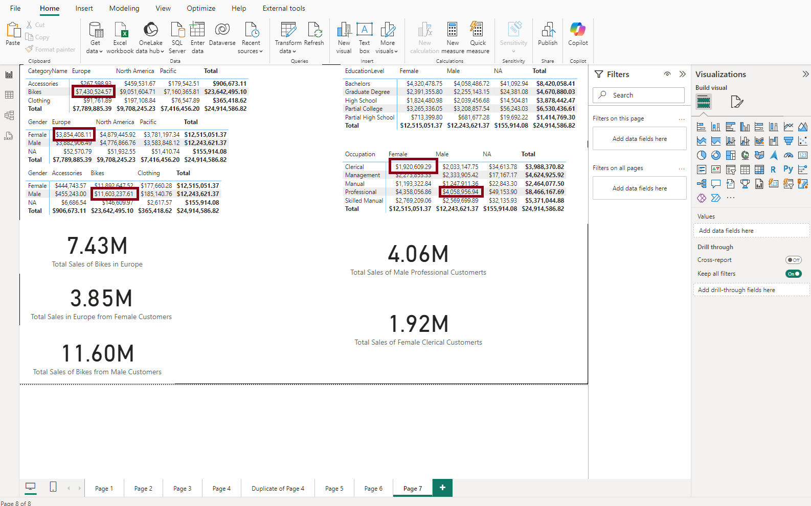

# Basic Formatting Syntax

## Paragraphs
___

This is a paragraph

This is another paragraph

# This is a heading 1
## This is a heading 2

### This is a heading 3

#### This is a heading 4

##### This is a heading 5

###### This is a heading 6

## Bold Italics, highlights
___

Bold : **BOLD** 
Italic : *Italic Text*
Strikethrough : ~~Strikethrough~~
Highlighted : ==Highlighted==
Bold and nested italic : **Bold text and *nested italic* text**
Bold and italic : ***Bold and Italic text***

\*\*This line will not be bold\*\*
\**This line will be in italic*\*

## Internal Links
___
Internal Links: [Three laws of motion](Introduction%20to%20PowerBI.md)

You have to escape blank spaces in links by replacing them with `%20` 
## External Links
___
External Link: [Obsidian Help](https://help.obsidian.md)

[My Note](obsidian://open?vault=MainVault&file=My%20Note.md)

[My Note](<obsidian://open?vault=MainVault&file=My Note.md>)

## External Images
___

You can change the image dimensions, by adding `|640x480` to the link destination, where the 640 is the width and the 480 is the height. 

If you only specify the width, the image scales according to the original aspect ratio. 

You can embed an image in the same folder structure. 

## Quotes
___
You can quote text by adding `>` symbols before the text 

> Human beings face ever more complex and urgent problems, and their effectiveness in dealing with these problems is a matter that is critical to the stability and continued progress of society. 

\- Doug Englebart, 1961

## Lists
You can create an unordered list by adding `-`, `*`, or `+` before the text. 

- First list item
- Second list item
- Third list item

To create an ordered list, start each line with a number followed by a `.` symbol.

1. First list item
2. Second list item
3. Third list item

## Task lists
To create a task list, start each list item with a hyphen and space followed by `[]`

- [x] This is a completed task.
- [ ] This is an incomplete task

## Nested lists
All list types can be nested in obsidian

1. First list item
	1. Ordered nested list item
2. Second list item
	- Unordered nested list item
	- 

- [ ] Task item 1 
	- [ ] Subtask 1 
- [ ] Task item 2 
	- [ ] Subtask 1

## Footnotes

This is a simple footnote[^1]

[^1]: This is the referenced text. 

[^2]: Add 2 spaces at the start of each new line. This lets you write footnotes that span multiple lines. 

[^note]: Named footnotes still appear as numbers, but can make it easier to identify and link references.

You can also use inline footnotes. ^[This is an inline footnote.]

## Comments 

This is an %%inline%% comment. 

%% 
This is a block comment. 
Block comments can span multiple lines. 
%%

